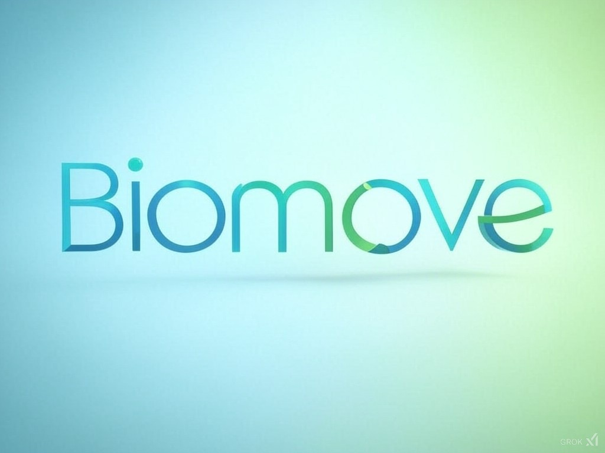
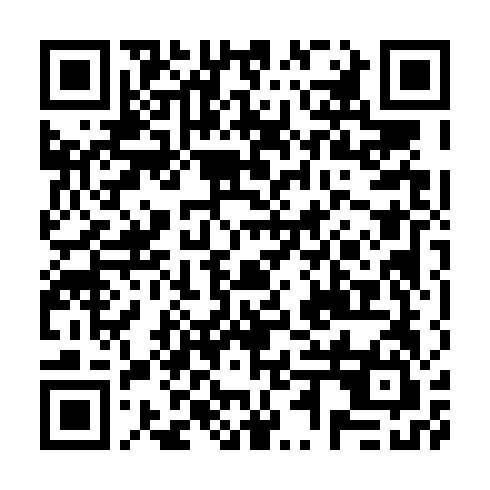

<p align="center">
  
</p>

<h1 align="center">🧠 SISTEMA EMG – BIOMOVE</h1>

<p align="center"><strong>Controle inteligente de próteses mioelétricas com IA e sinais EMG</strong></p>

<p align="center">
  <a href="https://kallebyx.github.io/SISTEMA_EMG/pt-br/assets/biomove_documentacao_institucional.pdf">📘 PDF Institucional</a> •
  <a href="https://kallebyx.github.io/SISTEMA_EMG/pt-br/assets/sistema_emg_documentacao_final.pdf">📄 Documentação Técnica</a> •
  <a href="https://doi.org/10.37779/nt.v25i3.5214">📚 Artigo Científico</a>
</p>

<p align="center">
  
</p>

---

## 🌐 Visão Geral

O **Sistema EMG da Biomove** é uma solução integrada para aquisição, processamento e classificação de sinais eletromiográficos (EMG), voltada para o controle de próteses mioelétricas acessíveis. Desenvolvido com Arduino, MyoWare 2.0, Python e machine learning, ele oferece uma alternativa de baixo custo e alto impacto social.

---

## 🚀 Tecnologias e Funcionalidades

- **Captação de Sinal EMG** com sensor MyoWare 2.0
- **Processamento digital** com filtros (notch, passa-alta, passa-baixa)
- **Classificação inteligente** com SVM, MLP e CNN
- **Controle de prótese real** via Arduino e motor
- **Calibração adaptativa** e segurança integrada
- **Extração de características** para aprendizado de máquina
- **Modularidade para expansão com novos sensores**

---

## 📚 Validação Científica

Este projeto foi validado por meio da publicação do artigo:

> **Desenvolvimento de um Sistema de Classificação de Movimentos da Mão Baseado em Sinais EMG Utilizando Aprendizado de Máquina**  
> MOTA, K.E.; SILVA, A.S.; PRIOR, M.V.P.; MARTINS, M.O.; RODRIGUES JR, L.F.  
> *Disciplinarum Scientia – Série Naturais e Tecnológicas*, UFN – v. 25, n. 3, 2024  
> [📖 Acesse aqui](https://doi.org/10.37779/nt.v25i3.5214)

---

## 🏗️ Estrutura do Projeto

```
sistema_emg/
├── arduino_myoware.ino
├── arduino_motor_control.ino
├── emg_processor.py
├── emg_classifier.py
├── prosthesis_controller.py
├── dados_treinamento/
├── modelos_treinados/
└── README.md
```

---

## 📦 Instalação

```bash
git clone https://github.com/KallebyX/SISTEMA_EMG.git
cd sistema_emg
pip install -r requirements.txt
```

---

## 🧠 Classificação em Tempo Real

Treine seu modelo com:

```bash
python emg_classifier.py
```

E inicie o controle da prótese com:

```bash
python prosthesis_controller.py --port /dev/ttyACM0 --model modelos_treinados/svm_model.pkl
```

---

## 🛡️ Segurança e Confiabilidade

- Timeout de acionamento
- Chaves de fim de curso
- Limiar de confiança ajustável
- Monitoramento contínuo da comunicação

---

## 📘 PDF e Documentação

- [📘 PDF Institucional da Biomove](https://kallebyx.github.io/SISTEMA_EMG/pt-br/assets/biomove_documentacao_institucional.pdf)
- [📄 Documentação Técnica do Sistema EMG](https://kallebyx.github.io/SISTEMA_EMG/pt-br/assets/sistema_emg_documentacao_final.pdf)

---

## 🧠 Futuro da Plataforma

- Reconhecimento de múltiplos gestos com LSTM
- Integração com sensores IMU e feedback tátil
- Controle via Bluetooth/Wi-Fi e app mobile
- Telemetria e cloud training

---

## 📄 Termos Legais

- [📘 Termos de Uso](TERMS_OF_USE.md)
- [🔐 Política de Privacidade](PRIVACY_POLICY.md)

---

## 🧾 Licença

Este projeto é distribuído sob a licença MIT.  
© 2025 Biomove • Todos os direitos reservados.

---

## 📬 Contato

- Desenvolvedor principal: [Kalleby Evangelho Mota](mailto:kallebyevangelho03@gmail.com)
- Empresa: ORYUM TECH (CNPJ: 49.549.704/0001-07)
- Instagram: [@kallebyevangelho](https://instagram.com/kallebyevangelho)
- Repositório oficial: [github.com/KallebyX/SISTEMA_EMG](https://github.com/KallebyX/SISTEMA_EMG)

---

## 🌍 Conheça a Startup Biomove

Acesse a [Landing Page Oficial da Biomove](https://kallebyx.github.io/Biomove) para explorar nossa missão, produtos e visão de impacto social com tecnologia assistiva.

Descubra como a Biomove está democratizando o acesso a soluções inteligentes como o Sistema EMG e ampliando o futuro da inclusão por meio da inovação.

---
