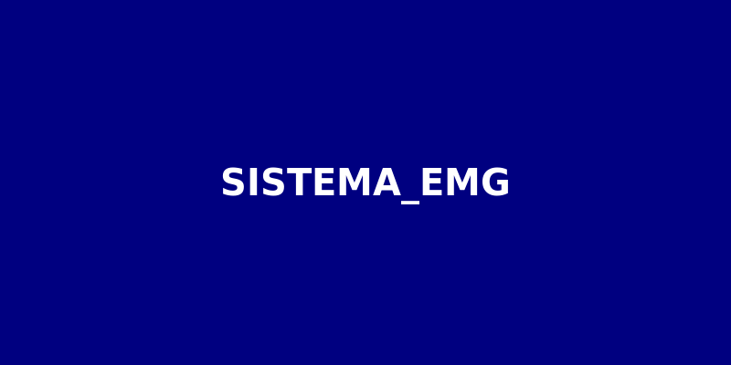
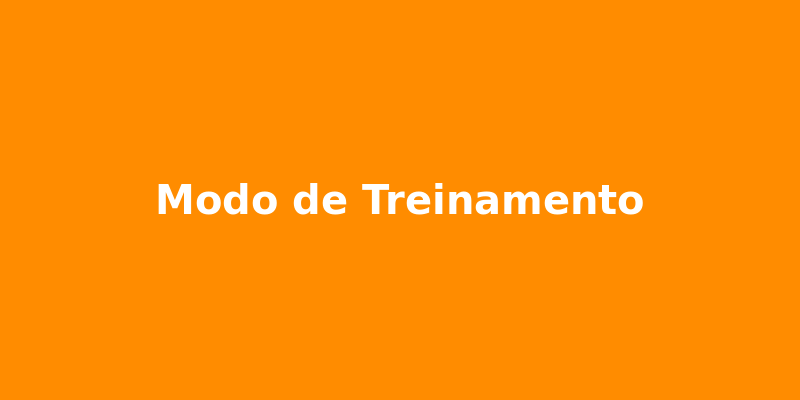
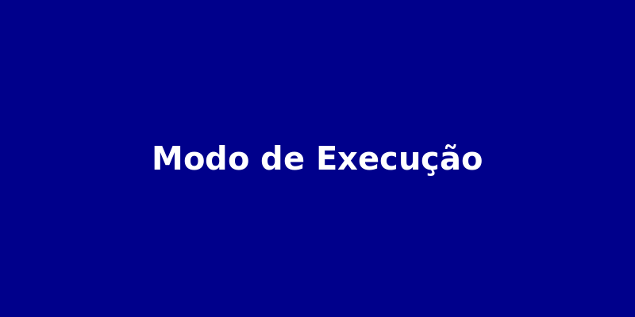

<<<<<<< HEAD
# SISTEMA_EMG



## Visão Geral

O SISTEMA_EMG é uma plataforma avançada para aquisição, processamento e classificação de sinais eletromiográficos (EMG) com aplicação direta no controle de próteses mioelétricas. O sistema integra hardware (Arduino + MyoWare 2.0) e software (Python) para criar uma solução completa que pode ser utilizada tanto em ambientes clínicos quanto educacionais.

### Características Principais

- **Coleta de sinais EMG reais** com Arduino + MyoWare 2.0
- **Tratamento e filtragem de sinais** (notch, highpass, lowpass)
- **Extração de características e aprendizado de máquina**
- **Controle de prótese física** (INMOVE)
- **Modo simulado** com banco de dados EMG públicos
- **Interface gráfica interativa** estilo "jogo" para simular controle da prótese
- **Compatibilidade** entre dados reais e simulados
- **Coleta de dados simulada** dentro do sistema

## Modos de Operação

O SISTEMA_EMG possui quatro modos principais de operação:

### 1. Modo de Simulação


Experimente o sistema usando sinais EMG simulados ou de bancos de dados públicos, sem necessidade de hardware.

### 2. Modo de Coleta


Colete seus próprios dados EMG para treinamento personalizado.

### 3. Modo de Treinamento


Treine modelos de aprendizado de máquina com seus dados coletados.

### 4. Modo de Execução


Controle a prótese em tempo real usando os modelos treinados.

## Instalação

### Requisitos do Sistema

**Hardware:**
- Arduino Uno/Mega/Nano
- Sensor MyoWare 2.0
- Prótese INMOVE (opcional para modo físico)
- Computador com porta USB

**Software:**
- Python 3.8 ou superior
- Bibliotecas Python (instaladas automaticamente via requirements.txt)
- Sistema operacional: Windows 10/11, macOS, Linux

### Procedimento de Instalação

1. **Clone o repositório ou extraia o arquivo ZIP:**
   ```
   git clone https://github.com/seu-usuario/SISTEMA_EMG.git
   ```

2. **Navegue até o diretório do projeto:**
   ```
   cd SISTEMA_EMG
   ```

3. **Instale as dependências:**
   ```
   pip install -r requirements.txt
   ```

4. **Conecte o hardware (se estiver usando o modo físico):**
   - Conecte o Arduino ao computador via USB
   - Conecte o sensor MyoWare 2.0 ao Arduino conforme o diagrama na documentação
   - Posicione os eletrodos no músculo alvo seguindo as instruções na documentação

## Iniciando o Sistema

Para iniciar o SISTEMA_EMG, execute o seguinte comando no terminal:

```
python main.py
```

Por padrão, o sistema será iniciado no modo simulado com interface gráfica. Para opções adicionais, consulte a documentação.

## Documentação

A documentação completa do SISTEMA_EMG está disponível nos seguintes arquivos:

- [Manual do Usuário (PT)](docs/manual_usuario_pt.md)
- [User Manual (EN)](docs/user_manual_en.md)
- [Algoritmos de Aprendizado de Máquina](docs/artigos/algoritmos_aprendizado_maquina.md)
- [Processamento de Sinais EMG](docs/artigos/processamento_sinais.md)

## Estrutura do Projeto

```
SISTEMA_EMG/
├── src/                      # Código-fonte principal
│   ├── acquisition/          # Módulo de aquisição de sinais
│   ├── processing/           # Módulo de processamento de sinais
│   ├── ml/                   # Módulo de aprendizado de máquina
│   ├── control/              # Módulo de controle de prótese
│   └── gui/                  # Interface gráfica
├── data/                     # Dados de exemplo e datasets
├── models/                   # Modelos pré-treinados
├── docs/                     # Documentação
│   ├── artigos/              # Artigos científicos
│   └── images/               # Imagens para documentação
├── tests/                    # Testes automatizados
├── scripts/                  # Scripts utilitários
├── main.py                   # Script principal
└── requirements.txt          # Dependências do projeto
```

## Exemplos

### Exemplo 1: Modo Simulado Básico

```python
from src.acquisition import synthetic_generator
from src.processing import filters, feature_extraction
from src.ml.models import svm_model
import numpy as np

# Gera sinal sintético
signal = synthetic_generator.generate_synthetic_emg(duration=5, fs=1000)

# Aplica filtros
filtered_signal = filters.apply_all_filters(signal, fs=1000)

# Extrai características
features = feature_extraction.extract_features(filtered_signal)

# Classifica o gesto
model = svm_model.SVMModel()
model.load("models/default_svm.pkl")
gesture = model.predict(np.array([list(features.values())]))

print(f"Gesto detectado: {gesture}")
```

### Exemplo 2: Visualização de Sinais

```python
import dearpygui.dearpygui as dpg
from src.gui import signal_visualizer
from src.acquisition import synthetic_generator

# Inicializa DearPyGui
dpg.create_context()
dpg.create_viewport(title="Visualização de Sinais EMG", width=800, height=600)
dpg.setup_dearpygui()

# Gera sinal sintético
signal = synthetic_generator.generate_synthetic_emg(duration=5, fs=1000)

# Cria visualizador
visualizer = signal_visualizer.SignalVisualizer()
visualizer.setup()
visualizer.update(signal)

# Inicia o loop principal
dpg.show_viewport()
dpg.start_dearpygui()
dpg.destroy_context()
```

## Contribuição

Contribuições são bem-vindas! Por favor, sinta-se à vontade para enviar um Pull Request.

## Licença

Este projeto está licenciado sob a licença MIT - veja o arquivo LICENSE para detalhes.

## Contato

Para questões, sugestões ou colaborações, entre em contato através de:
- Email: seu-email@exemplo.com
- GitHub: [seu-usuario](https://github.com/seu-usuario)
=======
>>>>>>> 73d7e1ae3c72454d97037d2fdbe4fcc591acd5d4
<p align="center">
  
</p>


<h1 align="center">🧠 SISTEMA EMG – BIOMOVE</h1>

<p align="center">
  
  
  
  
</p>

<p align="center">
  
  
  
  
  
</p>

<p align="center"><strong>Controle inteligente de próteses mioelétricas com IA e sinais EMG</strong></p>

<p align="center">
  <a href="https://kallebyx.github.io/SISTEMA_EMG/pt-br/assets/biomove_documentacao_institucional.pdf">📘 PDF Institucional</a> •
  <a href="https://kallebyx.github.io/SISTEMA_EMG/pt-br/assets/sistema_emg_documentacao_final.pdf">📄 Documentação Técnica</a> •
  <a href="https://doi.org/10.37779/nt.v25i3.5214">📚 Artigo Científico</a>
</p>

<p align="center">
  
</p>

---

## 🌐 Visão Geral

O **Sistema EMG da Biomove** é uma solução integrada para aquisição, processamento e classificação de sinais eletromiográficos (EMG), voltada para o controle de próteses mioelétricas acessíveis. Desenvolvido com Arduino, MyoWare 2.0, Python e machine learning, ele oferece uma alternativa de baixo custo e alto impacto social.

---

## 🚀 Tecnologias e Funcionalidades

- **Captação de Sinal EMG** com sensor MyoWare 2.0
- **Processamento digital** com filtros (notch, passa-alta, passa-baixa)
- **Classificação inteligente** com SVM, MLP e CNN
- **Controle de prótese real** via Arduino e motor
- **Calibração adaptativa** e segurança integrada
- **Extração de características** para aprendizado de máquina
- **Modularidade para expansão com novos sensores**

---

## 📚 Validação Científica

Este projeto foi validado por meio da publicação do artigo:

> **Desenvolvimento de um Sistema de Classificação de Movimentos da Mão Baseado em Sinais EMG Utilizando Aprendizado de Máquina**  
> MOTA, K.E.; SILVA, A.S.; PRIOR, M.V.P.; MARTINS, M.O.; RODRIGUES JR, L.F.  
> *Disciplinarum Scientia – Série Naturais e Tecnológicas*, UFN – v. 25, n. 3, 2024  
> [📖 Acesse aqui](https://doi.org/10.37779/nt.v25i3.5214)

---

## 🏗️ Estrutura do Projeto

```
sistema_emg/
├── arduino_myoware.ino
├── arduino_motor_control.ino
├── emg_processor.py
├── emg_classifier.py
├── prosthesis_controller.py
├── dados_treinamento/
├── modelos_treinados/
└── README.md
```

---

## 📦 Instalação

```bash
git clone https://github.com/KallebyX/SISTEMA_EMG.git
cd sistema_emg
pip install -r requirements.txt
```

---

## 🧠 Classificação em Tempo Real

Treine seu modelo com:

```bash
python emg_classifier.py
```

E inicie o controle da prótese com:

```bash
python prosthesis_controller.py --port /dev/ttyACM0 --model modelos_treinados/svm_model.pkl
```

---

## 🛡️ Segurança e Confiabilidade

- Timeout de acionamento
- Chaves de fim de curso
- Limiar de confiança ajustável
- Monitoramento contínuo da comunicação

---

## 📘 PDF e Documentação

- [📘 PDF Institucional da Biomove](https://kallebyx.github.io/SISTEMA_EMG/pt-br/assets/biomove_documentacao_institucional.pdf)
- [📄 Documentação Técnica do Sistema EMG](https://kallebyx.github.io/SISTEMA_EMG/pt-br/assets/sistema_emg_documentacao_final.pdf)

---

## 🧠 Futuro da Plataforma

- Reconhecimento de múltiplos gestos com LSTM
- Integração com sensores IMU e feedback tátil
- Controle via Bluetooth/Wi-Fi e app mobile
- Telemetria e cloud training

---

## 📄 Termos Legais

- [📘 Termos de Uso](TERMS_OF_USE.md)
- [🔐 Política de Privacidade](PRIVACY_POLICY.md)

---

## 🧾 Licença

Este projeto é distribuído sob a licença MIT.  
© 2025 Biomove • Todos os direitos reservados.

---

## 📬 Contato

- Desenvolvedor principal: [Kalleby Evangelho Mota](mailto:kallebyevangelho03@gmail.com)
- Empresa: ORYUM TECH (CNPJ: 49.549.704/0001-07)
- Instagram: [@kallebyevangelho](https://instagram.com/kallebyevangelho)
- Repositório oficial: [github.com/KallebyX/SISTEMA_EMG](https://github.com/KallebyX/SISTEMA_EMG)

---

## 🌍 Conheça a Startup Biomove

Acesse a [Landing Page Oficial da Biomove](https://kallebyx.github.io/Biomove) para explorar nossa missão, produtos e visão de impacto social com tecnologia assistiva.

Descubra como a Biomove está democratizando o acesso a soluções inteligentes como o Sistema EMG e ampliando o futuro da inclusão por meio da inovação.

---
